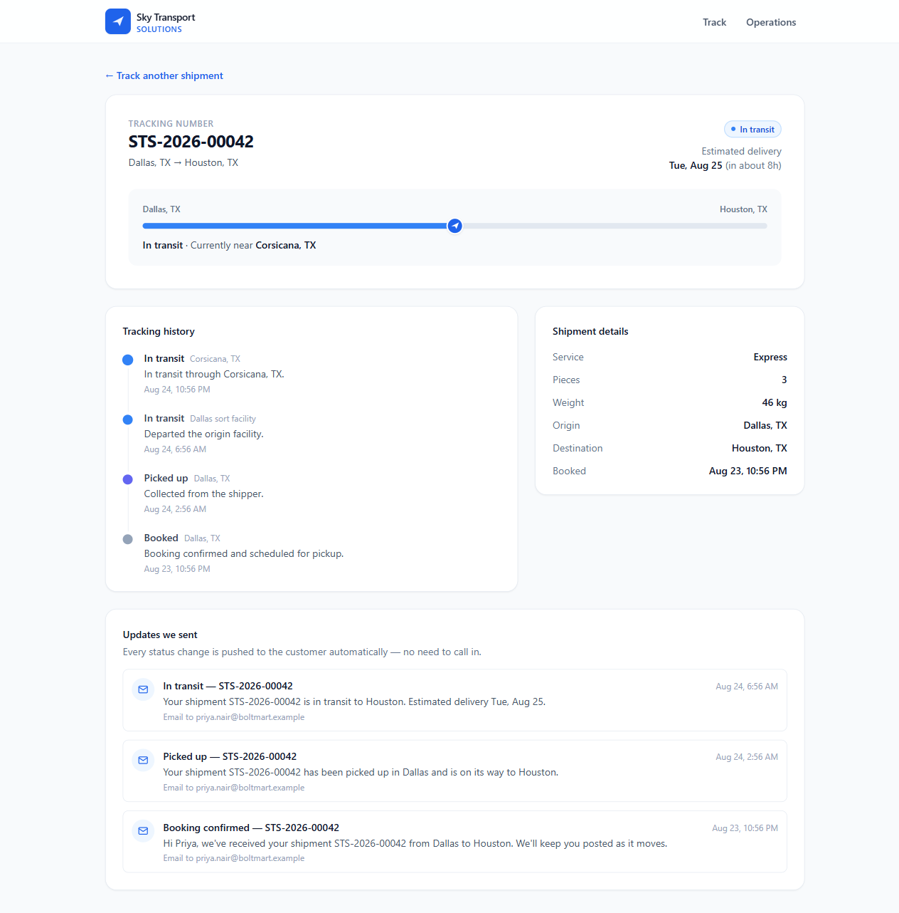
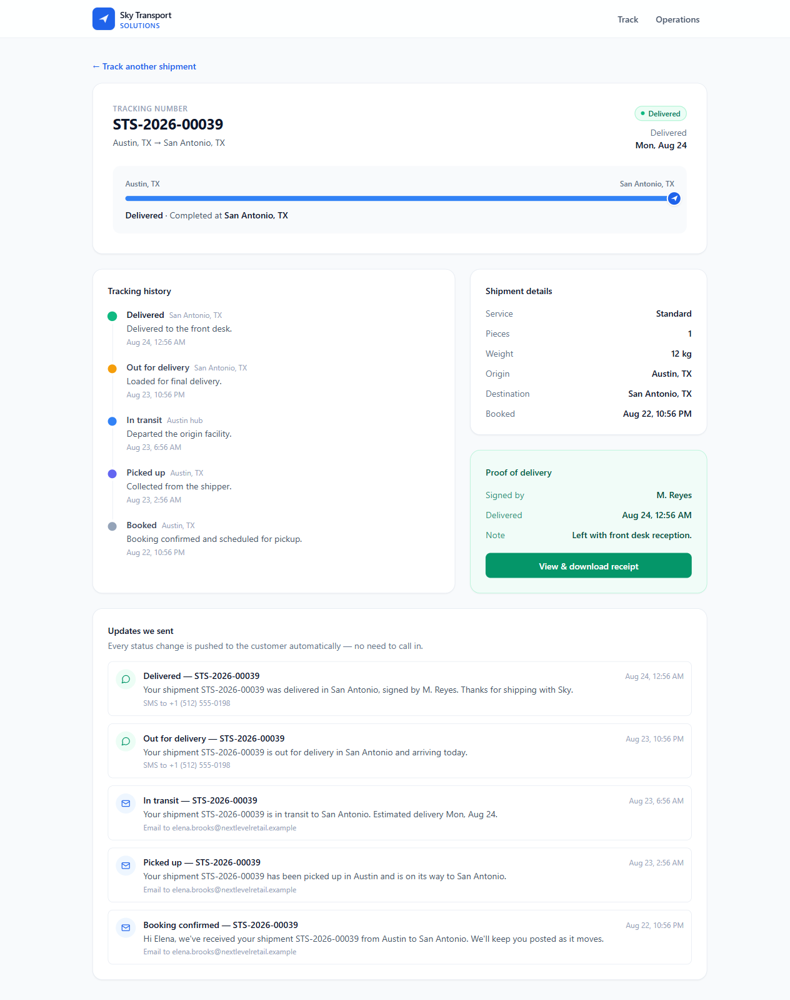
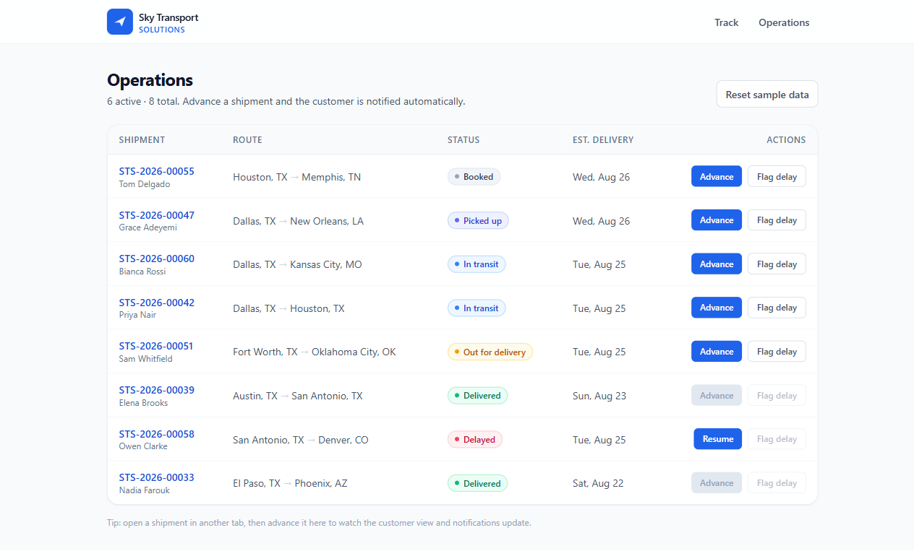
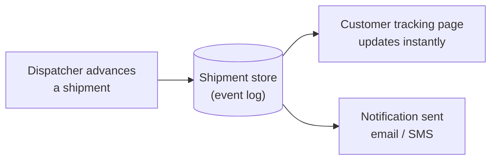

# Sky Track

**Self-service shipment tracking that answers "where's my shipment?" before anyone has to call.**

Sky Track is a tracking portal for a freight or courier operation. A customer types
in a tracking number and immediately sees where their shipment is, when it will
arrive, everything that has happened to it, and — once it's delivered — a receipt
they can download. And they don't have to go looking in the first place, because
every status change is pushed to them automatically.

It's a small, focused app built for the Sky Transport Solutions candidate exercise
(the **Experience** track). The write-up of the problem, the decisions, and what I'd
do next lives in [`REPORT.md`](REPORT.md).



---

## The problem

Pick almost any freight or courier business and a surprising share of inbound calls
are the same question: *"where's my shipment?"* The answer already exists — it's
sitting in the dispatcher's system — but the customer can't see it, so they call.
Every one of those calls costs staff time, interrupts the operations team, and
still leaves the customer feeling like they're chasing.

Nobody in that exchange actually wants the phone call. The customer wants an answer;
the dispatcher wants to move freight. The call only happens because there's no
self-serve way to get the status, and no push to the customer when it changes.

Sky Track closes both gaps.

---

## What it does

### 1. Customers track their own shipments

A tracking page with the status front and centre: a progress bar along the route,
the current location, an up-to-date delivery estimate, and the full history in plain
language. No login, no phone call.

### 2. Customers are notified at every step

Each status change generates a message — email or SMS — so the customer knows their
shipment is picked up, in transit, out for delivery, or delayed *without* checking.
This is the part that actually reduces call volume. Delivered shipments also get a
printable proof-of-delivery receipt.



### 3. Operations drives it from one screen

The dispatcher view lists every shipment and advances its status with a click —
or flags a delay. That action is what, in a real business, produces the update the
customer sees.



---

## How the pieces fit

Everything hangs off one idea: each shipment is an **ordered log of events**. The
status, the current location, the progress bar, and the notification feed are all
*derived* from that log, so they can never disagree with each other. When the
dispatcher advances a shipment, a new event is appended — and every surface updates
from the same source.



---

## Tech stack

| | |
| --- | --- |
| Framework | Next.js 14 (App Router) |
| Language | TypeScript |
| Styling | Tailwind CSS |
| Data | Small server-side store, persisted to a JSON file |

There's deliberately **no database to set up**. The store seeds itself from sample
data on first run and persists to `/data` (and degrades to in-memory if the
filesystem is read-only, e.g. on a serverless host). The interesting part of this
project is the flow, not the storage — so the storage stays out of the way.

---

## Getting started

Requires Node 18.18+ (built and tested on Node 22).

```bash
npm install
npm run dev
```

Open <http://localhost:3000>.

### Sample shipments

The app seeds eight shipments covering every state, with timestamps generated
relative to now so the data always looks current.

| Tracking number | State |
| --- | --- |
| `STS-2026-00042` | In transit |
| `STS-2026-00051` | Out for delivery |
| `STS-2026-00039` | Delivered (with proof of delivery) |
| `STS-2026-00058` | Delayed |
| `STS-2026-00055` | Booked |

### See the whole loop

1. Open `STS-2026-00051` on the tracking page.
2. In another tab, open `/dispatch` and click **Advance** on that shipment.
3. Reload the tracking tab — the status, timeline, and notifications have all moved
   forward together. **Reset sample data** on the operations view puts everything
   back for the next run-through.

---

## Run with Docker

The app builds to a self-contained image (Next.js standalone output), so it runs
anywhere with nothing installed but Docker.

```bash
docker build -t sky-transport .
docker run --rm -p 3000:3000 sky-transport
```

Then open <http://localhost:3000>.

---

## Project layout

```
src/
  app/
    page.tsx                     customer landing + search
    track/[trackingNumber]/      tracking page + printable POD receipt
    dispatch/                    operations view
    api/                         list / advance / delay / reset
  components/                    header, timeline, route bar, badges, feed, board
  lib/
    types.ts                     domain types
    seed.ts                      sample shipments
    store.ts                     the shipment store + notification derivation
    status.ts                    status flow, labels, progress
    format.ts                    date / label helpers
```

---

## A note on what's real

Notifications are **simulated**: they're derived from each shipment's event log and
shown as the feed a customer would receive, rather than sent through a live email or
SMS provider. That's a deliberate choice — it keeps the app runnable by anyone with
no accounts or API keys, while the message content and timing are exactly what a
real integration (SendGrid, Twilio) would send. Swapping in a real provider is a
single function at the edge; everything upstream already produces the message.

The reasoning behind this and the other trade-offs — no map API, JSON store over a
database, manual status advance over a TMS feed — is in [`REPORT.md`](REPORT.md),
along with what I'd build next.
